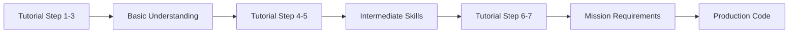

# Tutorial Engineering - Pedagogical Design for Technical Content

*Creating educational Rust content through progressive disclosure, hands-on learning, and error anticipation*

---

## 🎯 **Overview**

Tutorial Engineering is the systematic approach to creating technical educational content that balances theory with practice, anticipates learner struggles, and builds skills progressively. This methodology underpins all Mission tutorials (Mission1_tut through Mission9_tut) and daily study progressions in the Rust Study workspace.

**Core Philosophy**: Learning happens through **doing, failing, and understanding** - not passive reading.

---

## 🧠 **Pedagogical Principles**

### **1. Progressive Disclosure**
Introduce concepts in carefully sequenced layers, building on previous knowledge.

**Example: Mission1 Stack Tutorial (7 Steps)**
```markdown
Step 1: Basic Vec operations (push/pop foundation)
Step 2: Ownership rules with Vec (borrow checker introduction)
Step 3: Generic Stack<T> wrapper (abstraction layer)
Step 4: Error handling with Option (safe pop semantics)
Step 5: Iterator support (Rust idioms)
Step 6: Performance testing (criterion benchmarks)
Step 7: Complete API with documentation (production quality)
```

**Anti-Pattern**: Teaching generic types, ownership, iterators, and benchmarking simultaneously overwhelms learners.

---

### **2. Hands-On Learning**
Every concept includes **runnable code** that learners can execute, modify, and break.

#### **Pattern: Concept → Example → Exercise → Challenge**

**Concept Introduction**:
```rust
/// Ownership Transfer in Collections
/// 
/// When you push a value into Vec, ownership transfers to the Vec.
/// The original variable is no longer accessible.
```

**Runnable Example**:
```rust
fn main() {
    let value = String::from("hello");
    let mut v = Vec::new();
    
    v.push(value);  // Ownership moves here
    // println!("{}", value);  // ❌ Compile error: value moved
    
    println!("Vec contains: {:?}", v);  // ✅ Works
}
```

**Exercise**:
```rust
// TODO: Fix this code so it compiles
fn exercise_ownership() {
    let s = String::from("world");
    let mut v = Vec::new();
    v.push(s);
    println!("String: {}", s);  // How to fix this?
}
```

**Challenge**:
```rust
// CHALLENGE: Implement this without cloning
fn use_twice(value: String) {
    let mut v1 = Vec::new();
    let mut v2 = Vec::new();
    v1.push(value);  // First use
    v2.push(value);  // Second use - how?
}
```

---

### **3. Error Anticipation**
Predict common mistakes and address them **before** learners encounter frustration.

#### **Pattern: Pre-emptive Troubleshooting**

**Mission2 Queue Tutorial - Common Mistake Section**:

```markdown
### ⚠️ Common Mistake: Using Vec for FIFO

**Tempting but Wrong**:
```rust
// ❌ Inefficient: O(n) for removing from front
struct Queue<T> {
    items: Vec<T>,
}

impl<T> Queue<T> {
    fn dequeue(&mut self) -> Option<T> {
        if self.items.is_empty() {
            None
        } else {
            Some(self.items.remove(0))  // O(n) - shifts all elements!
        }
    }
}
```

**Why This Fails**:
- `Vec::remove(0)` shifts all remaining elements left
- 10,000 dequeue operations = O(n²) total complexity
- Violates REQ-2: O(1) FIFO operations

**Correct Solution**:
```rust
// ✅ Efficient: O(1) amortized
use std::collections::VecDeque;

struct Queue<T> {
    items: VecDeque<T>,  // Ring buffer
}

impl<T> Queue<T> {
    fn dequeue(&mut self) -> Option<T> {
        self.items.pop_front()  // O(1) - no shifting!
    }
}
```

**Verification**:
```rust
#[test]
fn benchmark_comparison() {
    // Vec::remove(0): ~50ms for 10k operations
    // VecDeque::pop_front(): ~0.5ms for 10k operations
    // 100x performance difference!
}
```
```

---

### **4. Multiple Learning Styles**

Support different learning preferences through varied content formats.

#### **Learning Style Support Matrix**

| Learning Style | Content Format | Example |
|----------------|---------------|---------|
| **Visual** | Diagrams, state transitions | Memory layout diagrams in Mission4 |
| **Analytical** | Formal specifications, proofs | V-Cycle traceability matrices |
| **Kinesthetic** | Type-to-learn exercises | Fill-in-the-blank code examples |
| **Pragmatic** | Real-world use cases | AoC solutions using mission concepts |

**Example: Mission4 Linked List (Visual Learners)**

```markdown
### Memory Layout Visualization

**Before insertion**:
```
head -> [1 | •] -> [2 | •] -> [3 | ∅]
```

**After inserting 4 at position 1**:
```
head -> [1 | •] -> [4 | •] -> [2 | •] -> [3 | ∅]
              ↑           ↓
         new_node    old_next
```

**Code realization**:
```rust
fn insert(&mut self, index: usize, value: T) {
    // Visual: new_node points to old_next
    let new_node = Box::new(Node {
        value,
        next: current.next.take(),  // old_next
    });
    // Visual: current points to new_node
    current.next = Some(new_node);
}
```
```

---

### **5. Incremental Complexity**
Build from simple to complex through deliberate stepping stones.

#### **Complexity Ladder: Mission5 HashMap Tutorial**

**Step 1: Basic Key-Value Storage (No Hashing)**
```rust
// Simplest possible: Vec of tuples
struct SimpleMap<K, V> {
    pairs: Vec<(K, V)>,
}
// Learning: Key-value concept, linear search
```

**Step 2: Fixed-Size Hash Table**
```rust
// Add hashing, but fixed size
struct FixedHashMap<K, V> {
    buckets: [Vec<(K, V)>; 10],  // 10 buckets
}
// Learning: Hash functions, collision handling
```

**Step 3: Dynamic Resizing**
```rust
// Add growth strategy
struct ResizableHashMap<K, V> {
    buckets: Vec<Vec<(K, V)>>,
    size: usize,
    load_factor: f32,
}
// Learning: Load factor, rehashing
```

**Step 4: Generic Hashing**
```rust
// Add BuildHasher trait
struct GenericHashMap<K, V, S: BuildHasher> {
    buckets: Vec<Vec<(K, V)>>,
    hash_builder: S,
}
// Learning: Trait bounds, custom hashers
```

**Step 5: Standard Library Integration**
```rust
// Understand std::collections::HashMap
use std::collections::HashMap;
// Learning: Production-quality implementation
```

Each step is **runnable independently** - learners can stop at any level and still have working code.

---

## 📋 **Tutorial Structure Template**

### **Opening Section (10% of content)**

```markdown
# Mission X Tutorial: [Concept Name]

## 🎯 Learning Objectives
By completing this tutorial, you will:
- [ ] Understand [core concept 1]
- [ ] Implement [practical skill 1]
- [ ] Debug [common error pattern]
- [ ] Benchmark [performance characteristic]

## 📚 Prerequisites
Before starting, you should be comfortable with:
- ✅ Chapter X: [Rust Book topic]
- ✅ Mission Y: [Previous mission concept]
- ✅ Day Z: [Related daily study topic]

**Estimated Time**: 2-3 hours (including exercises)

## 🗺️ Tutorial Roadmap
1. **Step 1**: Basic concept (30 min)
2. **Step 2**: Intermediate feature (45 min)
3. **Step 3**: Advanced pattern (45 min)
4. **Step 4**: Integration & polish (45 min)
```

---

### **Progressive Sections (70% of content)**

Each section follows **Concept → Example → Practice → Challenge** pattern:

```markdown
## Step N: [Section Title]

### 📖 Concept
[Theory with analogies and visual aids]

### 💡 Example
```rust
// Complete runnable code with inline comments
fn example() {
    // Step-by-step explanation
}
```

### ✏️ Practice Exercise
```rust
// Fill-in-the-blank or fix-this-code
fn exercise() {
    let mut map = HashMap::new();
    map.insert("key", ___);  // TODO: Complete this
}
```

### 🚀 Challenge
```rust
// From-scratch implementation
// CHALLENGE: Implement a function that...
fn challenge() {
    // Your code here
}
```

### ⚠️ Common Mistakes
- **Mistake 1**: [Description]
  - Why it fails: [Explanation]
  - How to fix: [Solution]

### ✅ Checkpoint
- [ ] Example compiles and runs
- [ ] Exercise passes tests
- [ ] Challenge meets requirements
```

---

### **Closing Section (20% of content)**

```markdown
## 🎓 Summary

You have now learned:
- ✅ [Skill 1] through [specific examples]
- ✅ [Skill 2] by implementing [concrete code]
- ✅ [Skill 3] and debugging [common errors]

## 🔗 Integration

This tutorial connects to:
- **Mission X**: Production implementation of these concepts
- **Day Y Notes**: Theoretical foundation
- **Chapter Z**: Rust Book reference material

## 🚀 Next Steps

Continue learning with:
1. **Mission X+1 Tutorial**: Builds on [this concept]
2. **Advanced Examples**: Real-world applications in `advanced_examples/`
3. **AoC Problems**: Apply these patterns to competitive programming

## 🧪 Self-Assessment

Test your understanding:
```rust
// Can you implement this without looking back?
fn assessment_challenge() {
    // [Final comprehensive exercise]
}
```

Expected time: 30 minutes
Solution: See `tutorials/MissionX_tut/solutions/assessment.rs`
```

---

## 🛠️ **Content Element Patterns**

### **1. Code Examples with Inline Explanations**

```rust
/// DOC: Use inline comments as teaching tool
fn explained_example() {
    // STEP 1: Create empty HashMap
    let mut scores = HashMap::new();
    
    // STEP 2: Insert key-value pairs
    // Note: Keys must implement Hash + Eq traits
    scores.insert("Alice", 10);
    scores.insert("Bob", 8);
    
    // STEP 3: Update existing value
    // entry() API provides elegant upsert pattern
    scores.entry("Alice")
          .and_modify(|score| *score += 5)  // If exists: add 5
          .or_insert(5);                    // If missing: insert 5
    
    // RESULT: Alice now has 15, Bob has 8
    assert_eq!(scores["Alice"], 15);
}
```

---

### **2. Before/After Comparisons**

```markdown
### Refactoring Pattern: Manual Loop → Iterator

**Before (Imperative)**:
```rust
let mut filtered = Vec::new();
for item in items {
    if item % 2 == 0 {
        filtered.push(item * 2);
    }
}
```

**After (Functional)**:
```rust
let filtered: Vec<_> = items.into_iter()
    .filter(|x| x % 2 == 0)
    .map(|x| x * 2)
    .collect();
```

**Benefits**:
- ✅ More concise (3 lines vs 5)
- ✅ Less mutable state
- ✅ Composable with other iterators
- ✅ Potentially optimizable by compiler
```

---

### **3. Interactive Debugging Exercises**

```markdown
### 🐛 Debug This Code

**Problem**: This code doesn't compile. Fix the errors.

```rust
fn broken_code() {
    let mut v = Vec::new();
    v.push(1);
    
    let first = &v[0];
    v.push(2);  // ❌ Error: cannot borrow `v` as mutable
    println!("First: {}", first);
}
```

**Hints** (progressive disclosure):
<details>
<summary>Hint 1: What does `first` hold?</summary>
`first` is a reference to data inside `v`. The reference is still alive when we try to mutate `v`.
</details>

<details>
<summary>Hint 2: What does push() do?</summary>
`push()` may reallocate the Vec, invalidating existing references.
</details>

<details>
<summary>Solution</summary>

```rust
fn fixed_code() {
    let mut v = Vec::new();
    v.push(1);
    
    {
        let first = &v[0];
        println!("First: {}", first);  // Use reference before mutation
    }  // first goes out of scope here
    
    v.push(2);  // ✅ Now we can mutate
}
```

**Key Lesson**: References must not outlive mutations to the borrowed data.
</details>
```

---

### **4. Visual Aids and Diagrams**

```markdown
### State Transition Diagram: HashMap Insertion

```
Initial State:
┌─────────────────────────────────┐
│ HashMap { size: 0, cap: 4 }     │
│ [∅] [∅] [∅] [∅]                 │
└─────────────────────────────────┘

After insert("key1", value1):
┌─────────────────────────────────┐
│ HashMap { size: 1, cap: 4 }     │
│ [•] [∅] [∅] [∅]                 │
│  │                               │
│  └─> ("key1", value1)            │
└─────────────────────────────────┘

After insert("key2", value2) - collision:
┌─────────────────────────────────┐
│ HashMap { size: 2, cap: 4 }     │
│ [•] [∅] [∅] [∅]                 │
│  │                               │
│  ├─> ("key1", value1)            │
│  └─> ("key2", value2)  ← chain  │
└─────────────────────────────────┘
```

**Code Realization**:
```rust
// Visual: Each bucket is a Vec for collision handling
type Bucket<K, V> = Vec<(K, V)>;
struct HashMap<K, V> {
    buckets: Vec<Bucket<K, V>>,
}
```
```

---

## 🎯 **Exercise Design Patterns**

### **Type 1: Fill-in-the-Blank (Beginner)**

```rust
/// Practice: HashMap insertion
fn exercise_insert() {
    let mut map = HashMap::new();
    
    // TODO: Insert key "Alice" with value 100
    map.insert(___, ___);
    
    // TODO: Retrieve Alice's value
    let score = map.get(___).unwrap();
    
    assert_eq!(*score, 100);
}
```

---

### **Type 2: Debug Challenge (Intermediate)**

```rust
/// Find and fix 3 bugs in this code
fn exercise_debug() {
    let mut map = HashMap::new();
    
    map.insert("key", "value");
    
    // Bug 1: What's wrong with this?
    let val = map["missing_key"];
    
    // Bug 2: Why doesn't this compile?
    for (k, v) in &map {
        map.insert("new", "value");
    }
    
    // Bug 3: What's the type error?
    let keys: Vec<String> = map.keys().collect();
}
```

---

### **Type 3: Extension Task (Advanced)**

```rust
/// Extend HashMap with a new method
impl<K, V> HashMap<K, V> 
where
    K: Eq + Hash,
{
    /// CHALLENGE: Implement this method
    /// Returns all values where the key starts with prefix
    fn values_with_prefix(&self, prefix: &str) -> Vec<&V> 
    where
        K: AsRef<str>,
    {
        // Your implementation here
        // Hint: Use filter() on keys()
        todo!()
    }
}

#[test]
fn test_extension() {
    let mut map = HashMap::new();
    map.insert("apple", 1);
    map.insert("apricot", 2);
    map.insert("banana", 3);
    
    let apples = map.values_with_prefix("ap");
    assert_eq!(apples.len(), 2);  // apple, apricot
}
```

---

### **Type 4: From-Scratch Implementation (Expert)**

```rust
/// CHALLENGE: Implement a complete HashMap from scratch
/// 
/// Requirements:
/// - Generic key/value types
/// - Basic operations: insert, get, remove
/// - Collision handling via chaining
/// - Resize at 75% load factor
/// 
/// Time estimate: 2-3 hours
/// 
/// Starter template:
pub struct MyHashMap<K, V> {
    buckets: Vec<Vec<(K, V)>>,
    size: usize,
}

impl<K, V> MyHashMap<K, V> 
where
    K: Eq + Hash,
{
    pub fn new() -> Self {
        todo!()
    }
    
    pub fn insert(&mut self, key: K, value: V) -> Option<V> {
        todo!()
    }
    
    // ... rest of implementation
}
```

---

## 📊 **Tutorial Integration Examples**

### **Mission1 Tutorial: Stack Implementation**

**Progressive Steps**:
1. **Step 1**: Vec basics - push/pop operations
2. **Step 2**: Ownership semantics - moving values into Vec
3. **Step 3**: Generic Stack<T> - wrapper pattern
4. **Step 4**: Error handling - Option<T> for safe pop
5. **Step 5**: Iterators - implementing IntoIterator
6. **Step 6**: Testing - unit tests with req_* naming
7. **Step 7**: Documentation - rustdoc with examples

**Coordination with Mission1**:
- Tutorial builds **toward** mission requirements
- Each step introduces **one** mission concept
- Final step produces **mission-compatible** code
- Tests use same **REQ-N traceability** pattern

---

### **Mission5 Tutorial: HashMap Deep Dive**

**Learning Objectives Alignment**:
| Tutorial Step | Mission Requirement | Daily Study Connection |
|---------------|---------------------|------------------------|
| Step 1: Key-value basics | REQ-1: Generic storage | Day 34: Chapter 8.3 |
| Step 2: Hash functions | REQ-3: Custom hashing | Day 35: Traits |
| Step 3: Collision handling | REQ-4: Chaining strategy | Day 36: Performance |
| Step 4: Resizing logic | REQ-2: O(1) amortized | Day 37: Benchmarking |

**Integration Points**:
- Tutorial references **Day 34-37** daily study notes
- Mission5 expects tutorial completion first
- AoC 2015 problems use HashMap patterns from tutorial

---

## 🎓 **Best Practices Summary**

### **Do's ✅**

1. **Start simple, end complex** - Progressive disclosure prevents overwhelm
2. **Make everything runnable** - Learners need hands-on practice
3. **Anticipate errors** - Address mistakes before frustration
4. **Test understanding** - Exercises at each step validate learning
5. **Connect concepts** - Link to missions, daily study, Rust Book
6. **Use multiple formats** - Code, diagrams, analogies, exercises
7. **Provide solutions** - With explanations of why they work

### **Don'ts ❌**

1. **Don't dump theory** - Balance explanation with practice
2. **Don't skip prerequisites** - State required knowledge upfront
3. **Don't ignore errors** - Show compile errors and fixes explicitly
4. **Don't teach in isolation** - Connect to broader learning tracks
5. **Don't assume background** - Verify prerequisites or teach them
6. **Don't use magic** - Explain every step explicitly
7. **Don't leave learners stuck** - Progressive hints for exercises

---

## 🔗 **Cross-Track Integration**

### **Tutorial → Mission Flow**



**Example: Learning Stack**
1. **Tutorial Day 1-2**: Vec basics, push/pop
2. **Daily Study Day 12**: Ownership rules
3. **Tutorial Day 3-4**: Generic Stack<T>
4. **Mission1**: Production Stack with V-Cycle

---

### **Tutorial → AoC Application**

**Pattern Recognition Flow**:
1. **Tutorial**: Learn HashMap collision handling
2. **Daily Study**: Frequency counting patterns
3. **AoC 2015 Day 3**: Apply HashMap for deduplication
4. **Advanced Example**: Optimize with custom hasher

---

## 📚 **Related Concepts**

### **Learning Methodology**
- [[Daily Study MOC]] - Systematic concept progression
- [[3-Track Integration]] - Coordinating tutorials, missions, daily study
- [[MONTHLY_CALENDAR]] - Daily activity scheduling

### **Content Design**
- [[V-Cycle Integration]] - Formal development in tutorials
- [[Rust Collections MOC]] - Collection-focused tutorials
- [[AoC Patterns MOC]] - Competitive programming education

### **Pedagogical Theory**
- [[Progressive Disclosure]] - Information architecture
- [[Error Anticipation]] - Teaching through common mistakes
- [[Hands-On Learning]] - Active vs passive learning

---

## 💡 **Key Takeaways**

1. **Learning happens through doing** - Code examples must be runnable and modifiable
2. **Progressive complexity is key** - Build from simple to complex deliberately
3. **Anticipate struggles** - Address common errors before learners encounter frustration
4. **Test understanding frequently** - Exercises at each step validate learning
5. **Connect to broader context** - Link tutorials to missions, daily study, real applications
6. **Support multiple learning styles** - Use diagrams, code, exercises, challenges
7. **Provide scaffolding** - Progressive hints for exercises prevent abandonment

**Remember**: Great tutorials make learners feel **capable** (I can do this!) rather than **overwhelmed** (This is too hard).

---

*Tags: #tutorial-engineering #pedagogy #education #learning-design #progressive-disclosure #hands-on-learning #rust-education #teaching-methodology #curriculum-design*

*Links: [[zettel-index]] | [[Daily Study MOC]] | [[3-Track Integration]] | [[V-Cycle Integration]] | [[Rust Collections MOC]] | [[AoC Patterns MOC]] | [[MONTHLY_CALENDAR]]*
